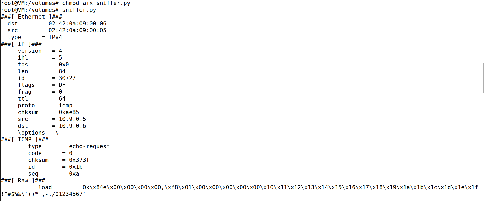

# Packet Sniffing and Spoofing

# Setup

Our environment consists of 3 different machines, attacker, hostA and hostB. All the attacks were performed on the attacker machine.

After setting up the containers, we ran `ifconfig` and searched for the entry with **10.9.0.1** IP.


We found the name of our network interface: **br-a8e50947a7ec**. 

## Task 1.1: Sniffing Packets

Our first task was to sniff the packets on our network interface using the following program:

```Python
#!/usr/bin/env python3
from scapy.all import *

def print_pkt(pkt):
    pkt.show()

pkt = sniff(iface='br-a8e50947a7ec', filter='icmp', prn=print_pkt)
```

The "iface" parameter establishes the network interface we wanted to sniff.

### 1.1A: Changing the Priviliges

We need to run the program two times: one with the **root** privilege and one without it:

```bash
$ chmod a+x sniffer.py
```
We entered the HostA container and pinged HostB.

```bash
$ ping 10.9.0.6
```

With root privilege:



Without:


### 1.1B: Filtering Packets

For this task we were asked to filter the packets we were going to sniff.

* **Capture only the ICMP packet**

This prompt uses the same command as the first task and there's a print with the [result](#11a-changing-the-priviliges1.1A).

* **Capture any TCP packet that comes from a particular IP and with a destination port number 23.**

For the second prompt:

```python
pkt = sniff(iface='br-a8e50947a7ec', filter='tcp and src host 10.9.0.5 and dst port 23', prn=print_pkt)
```

We ran the script and then in the Host A wrote this to port 23:

```bash
$ echo "MESSAGE" > /dev/tcp/10.9.0.6/23
```

The result:


* **Capture packets that come from or to go to a particular subnet.**

For the final prompt, we need to use a **subnet**.


By applying the **255.255.255.0** netmask to the interface - 10.0.2.15 - we achieved **10.0.2.0/24**:

```python
pkt = sniff(iface='enp0s3', filter='net 10.0.2.0/24', prn=print_pkt)
```


## Task 1.2: Spoofing ICMP Packets

In the next task we had to use Scapy to spoof **ICMP** packets with an arbitrary source IP address and they had to be **echo request** packets.

We used the following code:

```python
from scapy.all import *
ip = IP()

ip.src = '10.9.0.5' # host A
ip.dst = '10.9.0.6' # host B

packet = ip/ICMP()

send(packet)
```


We also opened Wireshark with root permissions and capture the packets.


## Task 3: Traceroute

In this task, we had to implement a version of `traceroute` using Scapy.

We found that the `sr1()` is used to send packets and receive their respective answers, returning one packet that answered the packet sent.

An ICMP packet can be dissolved into these two:

* **Type -** Identifies the message they transmit.
* **Code -** For a given type, could make the message more specific.

We then created our script:

```python
from scapy.all import *

a = IP(dst='10.9.0.5', ttl=1) #host A, we also used 8.8.8.8 for google.com
while 1:
    packet = a / ICMP()
    reply = sr1(packet, timeout=1)
    if reply == None or (reply.type == 11 and reply.code == 0): # Error message
        a.ttl += 1
        continue

    break

print("Distance: ", a.ttl)
```

The result for `10.9.0.5` was:


And for `8.8.8.8`:


## Task 4: Sniffing and-then Spoofing

This task consisted in combining the sniffing and spoofing techniques. If the packet was an **ICMP echo request**, we need to reply with an **ICMP echo reply** packet:

```python
!#/usr/bin/env python3
from scapy.all import *

def send_reply(pkt):
    if pk[ICMP].type != 8
        return
    ip = IP(src = pkt[IP].dst, dst = pkt[IP].src)
    icmp = ICMP(type = 0, id = pkt[ICMP].id, seq = pkt[ICMP].seq)
    data = pkt[Raw].load
    reply = ip / icmp / data
    send(reply, verbose = 0)

pkt = sniff(iface='br-a8e50947a7ec', filter='icmp', prn=send_reply)
```

After that the guide told us to ping 3 distinct IP's:

- 1.2.3.4

When pinging 1.2.3.4 without the program, we were not receiving **ANY** packets.


And pinging while running the program:


By checking Wireshark, we saw that the packets were going through the attacker machine (10.9.0.1) and sending replies:


Therefore, our program worked. 

- 10.9.0.99

When pinging 10.9.0.99 with or without the program, we were not receiving **ANY** packets.


Because 10.9.0.99 is in the same Local Area Network as Host A, the packets did not go through the attacker machine.


- 8.8.8.8

Finally, by pinging 8.8.8.8 without the program, we received the packets.


And with:


Because 8.8.8.8 is Google's DNS and it is an actual existing host, it's normal that the packets go through the attacker machine. Therefore, it's also expected that Host A receives duplicaded packets.

