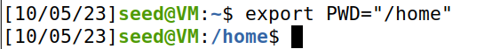
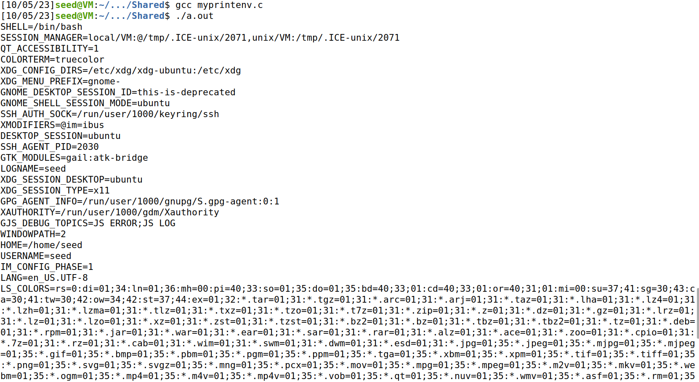
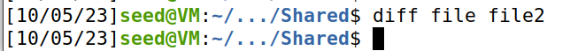
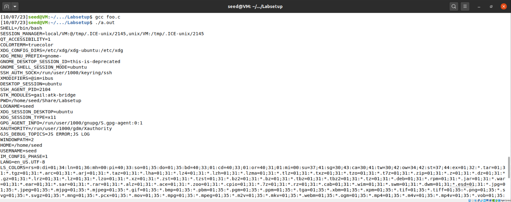

# Trabalho realizado na Semana #4

## Task 1

>- After running printenv
>
>
>- After running printenv PWD to specify the variable
>
>
>- Changing PWD from "/home/seed" to "/home" with export
>
>
>- Unsetting the PWD variable
>
>

## Task 2

>- With line 2 commented out, this is the output of myprintenv.c, which we passed to a file.
>
>
>- With line 2 uncommented and line 1 commented out, the output looks like this:
>
>
>- After using the diff command, we can see there are no differences between the programs' outputs.
>

## Task 3

>- In Step 1, after compilling and running the code, it resulted in no actual output.
>- Step 2 though was different. After changing `execve("/usr/bin/env", argv, NULL);` to `execve("/usr/bin/env", argv, environ);` we got the output of all the environment variables!

>
>

