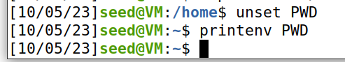
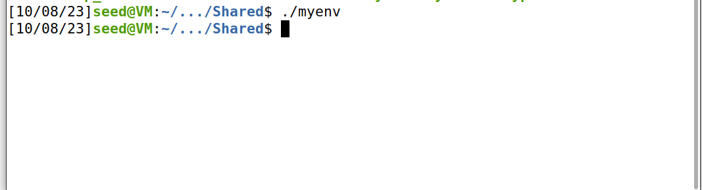
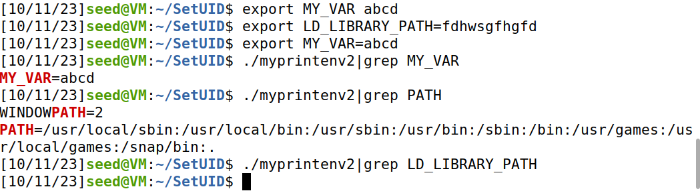

# Trabalho realizado na Semana #4

## Task 1

>- After running printenv
>
>
>- After running printenv PWD to specify the variable
>
>
>- Changing PWD from "/home/seed" to "/home" with export
>
>
>- Unsetting the PWD variable
>
>

## Task 2

>- With line 2 commented out, this is the output of myprintenv.c, which we passed to a file.
>
>
>- With line 2 uncommented and line 1 commented out, the output looks like this:
>
>
>- After using the diff command, we can see there are no differences between the programs' outputs.
>

## Task 3

This task's objective is to analyse the behaviour of environment variables when the program is executed via the execve() function.

>- After executing myenv.c with the "NULL" expression as the function's third parameter, the output of the program is null. 
>
>
>- Now with the variable "environ" as the third parameter:
>

When the parameter was "NULL", the environment variables could not be registered there, but when we changed to a non-null variable, the environment variables are registered and then outputted.

## Task 4

In this task, we will use the system() function instead of execve(), which means that, instead of executing the command directly, we will first ask the shell to run it.

>- By using the system() function and asking the shell to run the command, we have access to root privileges.
>

## Task 5

After doing this task we were surprised to see that LD_LIBRARY_PATH didn't print unlike MY_VAR and PATH.

>

## Task 6
