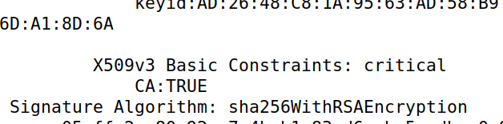
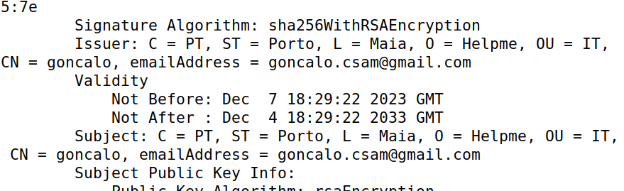
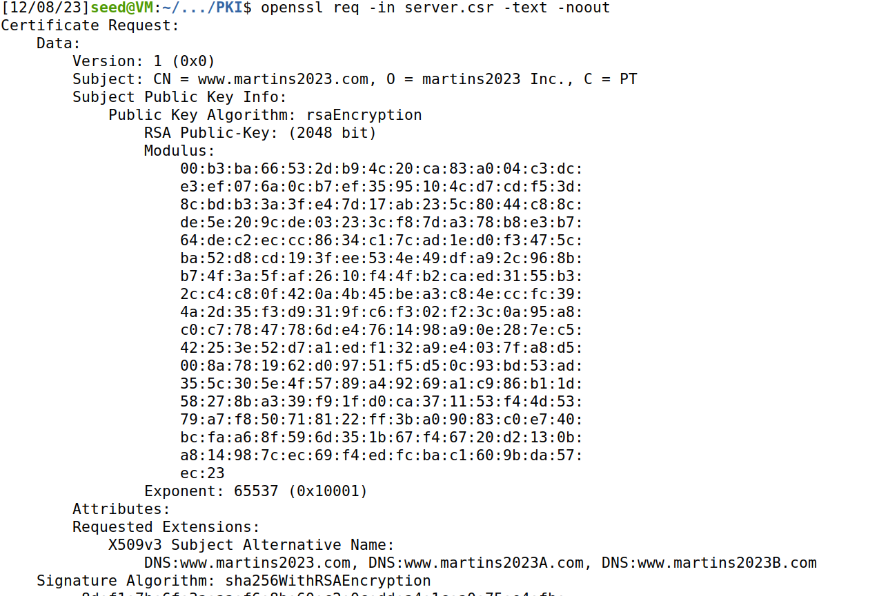
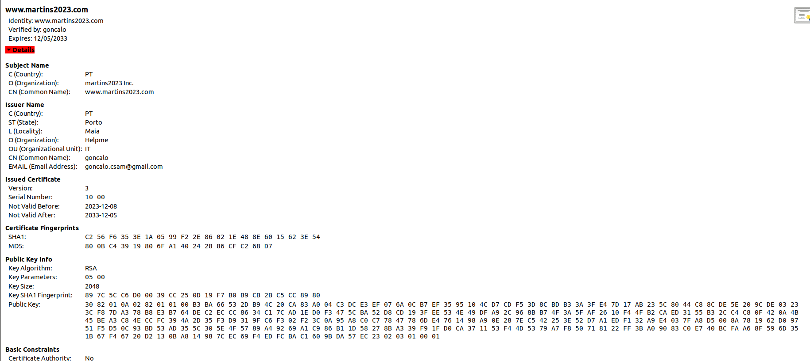
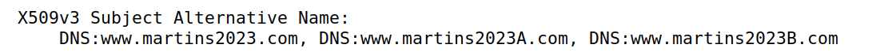
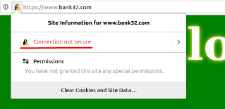
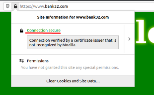
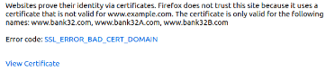
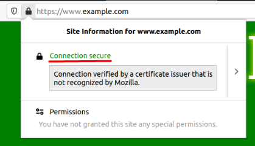

# Public-Key Infrastructure

## Setup

Write the entries `10.9.0.80 www.bank32.com` and `10.9.0.80 www.martins2023.com` to the VM's known hosts:

```bash
sudo nano etc/hosts    

$ dcbuild               # docker-compose build
$ dcup                  # docker-compose up
$ dockps
$ docksh 08
```
## Task 1 - Becoming a CA

We copied the default certificate to the local folder, uncommented the `unique_subject` line and did the following commands.

```bash
mkdir demoCA && cd ./demoCA
mkdir certs crl newcerts
touch index.txt
echo "1000" >> serial
```
```bash
openssl req -x509 -newkey rsa:4096 -sha256 -days 3650 -keyout ca.key -out ca.crt
```

We filled the data that was asked and went to see the files' contents:

```bash
openssl x509 -in ca.crt -text -noout
openssl rsa -in ca.key -text -noout
```

CA: TRUE means it's a real CA certificate.



The issuer and subject fields are the same, so it's a self-signed certificate.



Here you can see a part of the key cryptography file:



## Task 2 - Generating a Certificate Request for Your Web Server

We generated a certificate for the `www.martins2023.com` website (and later for `www.bank32.com` as well because we could not get the martins2023.com site working with apache):

```bash
openssl req -newkey rsa:2048 -sha256 -keyout server.key -out server.csr -subj "/CN=www.martins2023.com/O=Martins2023 Inc./C=PT"  passout pass:dees -addext "subjectAltName = DNS:www.martins2023.com, DNS:www.martins2023A.com, DNS:www.martins2023B.com"
```
## Task 3 - Generating a Certificate for Your Server

```bash
$ openssl ca -config openssl.cnf -policy policy_anything -md sha256 -days 3650 -in server.csr -out server.crt -batch -cert ca.crt -keyfile ca.key
```

The following image contains the contents in the `server.crt` file:



We uncommented the copy_extensions line in the `openssl.cnf` file and ran the following code:

```bash
$ openssl x509 -in server.crt -text -noout
```

Which showed that the certificate all website variations:



## Task 4 - Deploying Certificate in an Apache-Based HTTPS Website

From this task onwards will be using `www.bank32.com` rather than `www.martins2023.com`.

We copied the `server.ctf` and `server.key` to the `volumes` folder and changed the files names to `bank32.ctf` and `bank32.key` respectively, and changed the bank32_apache_ssl.conf file to:

```
<VirtualHost *:443> 
    ...
    SSLEngine On 
    SSLCertificateFile /volumes/bank32.crt
    SSLCertificateKeyFile /volumes/bank32.key
</VirtualHost>
```
We started the apache server in the container shell we opened earlier and got this in the `https://www.bank32.com`.



As we can see, connection is not safe, so we need to add our CA certificate to the browser's authorities in `About -> Preferences -> Privacy -> Certificates -> View Certificates -> Authorities -> Import`.



## Task 5 - Launching a Man-In-The-Middle-Attack

We changed the server config so that `www.example.com` was shown with the previous config. We had to add it to the VM hosts file.

By restarting the apache service the website alerted us of potential risks.



## Task 6 - Launching a Man-In-The-Middle-Attack with a Compromised CA

We start by repeating Task 2's commands for `www.example.com`:

```bash
$ openssl req -newkey rsa:2048 -sha256 -keyout example.key -out example.csr -subj "/CN=www.example.com/O=example Inc./C=US" -passout pass:dees
$ openssl ca -config openssl.cnf -policy policy_anything -md sha256 -days 3650 -in example.csr -out example.crt -batch -cert ca.crt -keyfile ca.key
```

We also modified the `bank32_apache_ssl.conf` file again, this time with the `example.csr` and `example.key` files.

When restarting the apache server and going to `https://www.example.com` we can verify that the connection is secure.


