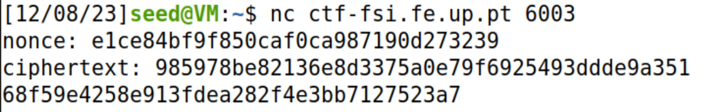
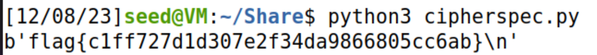

#Weak encryption

##Analysis

As always, we start off by analysing what we're given. First let's look at the Python file we're given:

This file is the one used to generate, encrypt and decrypt the messages.

- gen():  Function that generates the cipher key:

```python
def gen(): 
	offset = 3 # Hotfix to make Crypto blazing fast!!
	key = bytearray(b'\x00'*(KEYLEN-offset)) 
	key.extend(os.urandom(offset))
	return bytes(key)
```

Looking at this, it is obvious the vulnerability: the **offset** being 3. What does this mean? This means that the key created is only has three random bytes and the rest of the key is just 0. We'll look further how to exploit this.

- enc() : Function that takes the cipher key and nonce and encrypts the message with the AES chiper.
  
```python
def enc(k, m, nonce):
	cipher = Cipher(algorithms.AES(k), modes.CTR(nonce))
	encryptor = cipher.encryptor()
	cph = b""
	cph += encryptor.update(m)
	cph += encryptor.finalize()
	return cph
```

- dec(): Function that takes the cipher key and nonce and decripts the message with the AES cypher.

We also have access to a server through the *nc ctf-fsi.fe.up.pt 6003* command, which has the following output:




##Exploiting the Vulnerability

Now, its obvious what we must do to get the flag. The flag is contained within the encrypted message we got with the server: *985978be82136e8d3375a0e79f6925493ddde9a35168f59e4258e913fdea282f4e3bb7127523a7* and we must decrypt! As there's only 3 bytes that are random, we can simply bruteforce it. It will take 2-3 minutes, but that's a valid timeframe. We also should note that we also have the nonce: *e1ce84bf9f850caf0ca987190d273239*.

We can now start to create the scritpt! First off let's turn the ciphertext and the nonce into variables in their right byte format:

```python
ciphertext = bytes.fromhex('985978be82136e8d3375a0e79f6925493ddde9a35168f59e4258e913fdea282f4e3bb7127523a7')
nonce = bytes.fromhex('e1ce84bf9f850caf0ca987190d273239')
```

As we're going to be doing a bruteforce, we must check each decrypted message to see if it is the correct one. We will thus create a function for it! How do we know that the decrypted message is the flag? If it has *b'flag{* in it:

```python
def check_key(key):
    decrypted_message = dec(key, ciphertext, nonce)
    if b'flag{' in decrypted_message:  
        print(f"Found key: {key.hex()}")
        print(f"Decrypted message: {decrypted_message}")
        return key.hex()
```

Now we will just create the main bruteforce, which is simply 3 for loops for the 3 possible bytes. When we get the message we will print it in the terminal:

```python
ciphertext = bytes.fromhex('985978be82136e8d3375a0e79f6925493ddde9a35168f59e4258e913fdea282f4e3bb7127523a7')
nonce = bytes.fromhex('e1ce84bf9f850caf0ca987190d273239')

for i in range(0, 256):  
    for j in range(0, 256):
        for k in range(0, 256):
            key = b'\x00' * (KEYLEN - 3) + bytes([i, j, k])
            msg = dec(key,ciphertext,nonce)
            if msg[:4] == b"flag":
                print(msg)
                exit()
```



The flag is thus **flag{c1ff727d1d307e2f34da9866805cc6ab}**!
